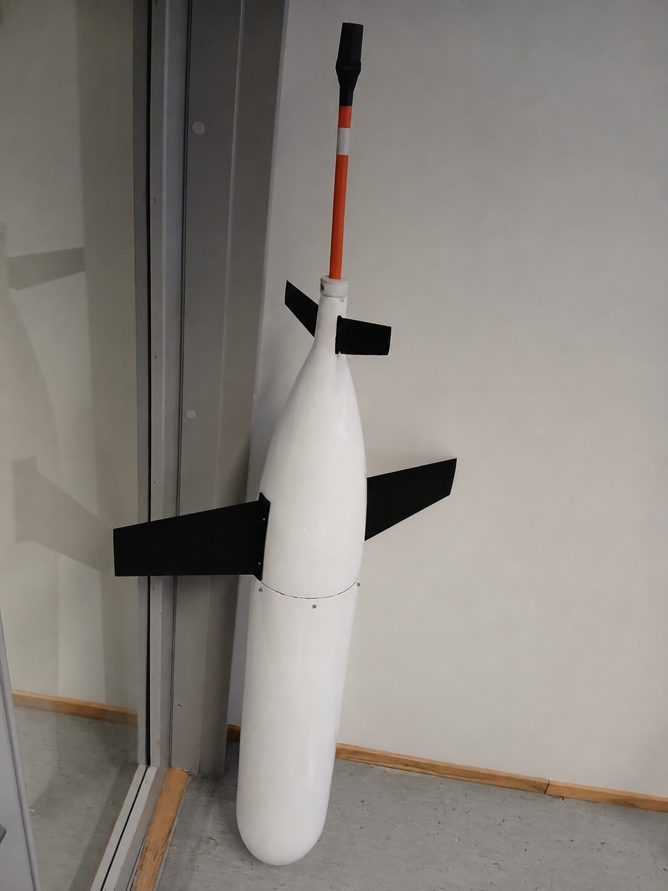

# Open-Source Glider

An open-source effort to create a practical underwater glider blueprint for students, hobbyists, and citizen scientists.

The goal is to make it possible to explore and study the ocean down to around 200 m, and eventually 1000 m, autonomously for weeks or even months without relying on an expensive commercial glider.

This repository is the project hub:

- [GitHub](https://github.com/e-abdi?tab=repositories) hosts the files and development history.
- [Read the Docs](https://open-source-glider.rtfd.io) hosts the background knowledge and wiki-style documentation.
- [Hackaday](https://hackaday.io/project/196850-open-source-glider) tracks the build process and project log.

If you have suggestions or want to contribute, feel free to get in touch at ehs.abdi@gmail.com.

## About the Author

I am a maker (with electronics engineering background) who has been working with commercial underwater gliders since 2015, and I still find them fascinating and fun.

The goal of this project is to pass along what I have learned to students and hobbyists, and hopefully help make ocean data collection more accessible. I believe strongly in citizen science, and I think that once gliders become accessible to the general public, we could see a major transformation in how ocean data is gathered.

This is not a simple problem. Oceans are harsh environments, and there are good reasons why commercial gliders require so much engineering effort and cost. At the same time, companies like Blue Robotics have shown that reliable and affordable marine instruments can be built around open designs. My hope is that more experts will join and help turn this into a robust and affordable open-source underwater glider.

I will almost certainly make wrong assumptions and mistakes while trying to explain gliders and figure out how to build one from scratch. If you see something that should be corrected or improved, please contribute and help make the project better.
